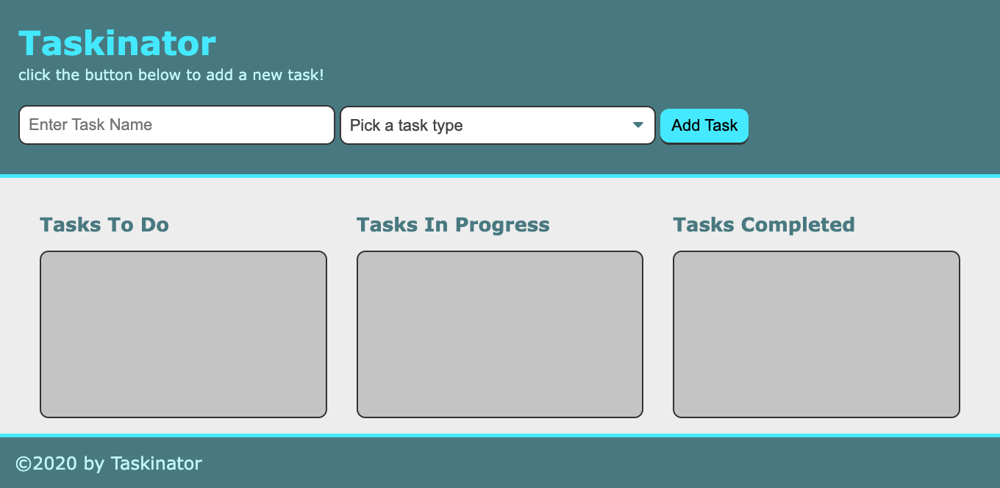

# taskinator

## Purpose
In this website a user us able to add tasks to a tasks to do section, task in progress section or a task completed section. initialy when a user adds a task it goes into the tasks to do section and then you can select the dropdown to change it to the oter in progress sections or the completed secions. also in each of the sections the user can edit or delete the task.

## Built With
* HTML5 
* CSS3
* Javascript

## Website Link
https://itzamary.github.io/taskinator/

## Image
